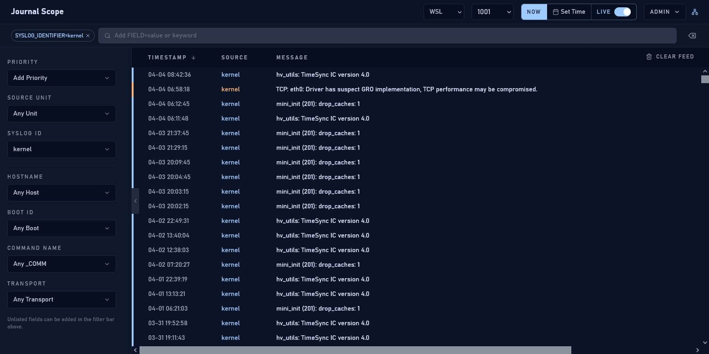
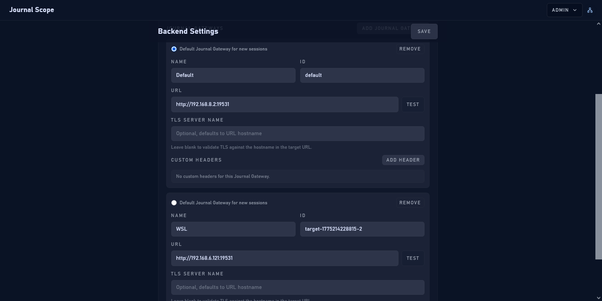
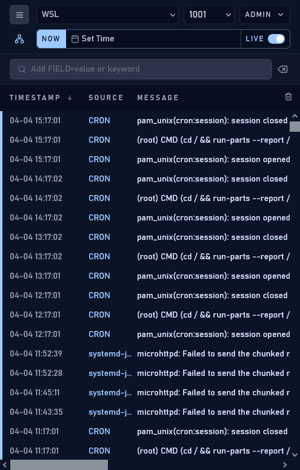

# Journal Scope

### Modern, lightweight web interface for systemd-journald

[简体中文](docs/README.zh-CN.md)

Journal Scope provides a fast, easy-to-deploy alternative to powerful but complex log management stacks, allowing you to view logs pulled from `systemd-journal-gatewayd` directly in your browser.



<details>
<summary>Click to expand: More Screenshots (Backend, Mobile, etc.)</summary>
<br/>





</details>

---

## 🚀 Key Features

- **Live Tail**: View logs in real-time directly in your browser.
- **Filtering**: Support for filtering by Unit, Syslog ID, Hostname, Boot ID, Transport, and log levels.
- **Multi-Gateway Switching**: Easily switch between multiple Journal Gateway targets.
- **PWA & Mobile Support**: Responsive design with PWA support, installable as an app on desktop and mobile.
- **Low Footprint**: Lightweight Go backend with embedded static assets—no complex runtime required.

---

## 🚀 Deployment & Setup

### 1. Prerequisites: Enable Journal Gateway

Journal Scope relies on `systemd-journal-gatewayd` to fetch logs.

```bash
# Install the component (example for Debian/Ubuntu)
sudo apt install systemd-journal-remote

# Start and enable the Socket
sudo systemctl enable --now systemd-journal-gatewayd.socket
```
*Note: This service listens on port 19531 on all interfaces by default. To restrict it (e.g., to localhost only), run `sudo systemctl edit systemd-journal-gatewayd.socket` and add:*

```ini
[Socket]
ListenStream=
ListenStream=127.0.0.1:19531
```
> [!TIP]
> Configuring mTLS is a more secure option. However, please note that `systemd-journal-gatewayd` in Debian currently has a known bug that prevents mTLS from working correctly (see [Debian Bug #1100729](https://bugs.debian.org/cgi-bin/bugreport.cgi?bug=1100729)).

### 2. Run Journal Scope

#### Option A: Using Docker
```bash
docker run --name journal-scope -d -p 3030:3030 \
  -v ./journal-scope-data:/data \
  ghcr.io/outlook84/journal-scope:latest
```

#### Option B: Using Binary
Download the binary for your system from the [Releases](https://github.com/anshi/stitch/releases) page:
```bash
# Run it
./journal-scope
```
Once started, access the Web UI. After logging in with the `admin` access code, click the **Backend** option in the top-right menu to add a Journal Gateway address.

> [!IMPORTANT]
> **First Run**: The initial `admin` and `viewer` access codes are printed directly to the **terminal output** or **Docker logs**.
> 
> **Lost your Admin code?**
> 1. Stop Journal Scope.
> 2. Edit the `data/config.json` file (default path).
> 3. Set the `admin_code_hash` value to `""` (empty string) and save.
> 4. Restart the service; a new admin code will be generated and printed to stdout.

---

## ⚙️ Environment Variables

### Server Settings
| Variable | Description | Default |
| :--- | :--- | :--- |
| `JOURNAL_SCOPE_LISTEN_ADDR` | Server listen address | `127.0.0.1:3030` |
| `JOURNAL_SCOPE_DATA_DIR` | Directory for persistent state | `data` |
| `JOURNAL_SCOPE_TRUST_PROXY_HEADERS` | Trust `X-Forwarded-For` from reverse proxies | `false` |

<details>
<summary>Click to expand: More Environment Variables</summary>
<br/>

### Security & Auth
| Variable | Description | Default |
| :--- | :--- | :--- |
| `JOURNAL_SCOPE_MASTER_SECRET` | Deployment-level root secret (auto-generated if unset) | *auto* |
| `JOURNAL_SCOPE_BOOTSTRAP_ADMIN_CODE` | Initial admin access code (first start only) | *auto* |
| `JOURNAL_SCOPE_SESSION_TTL` | Session duration | `168h` |
| `JOURNAL_SCOPE_COOKIE_SECURE` | Set `Secure` attribute on cookies (recommended over HTTPS) | `false` |

### Journal Gateway Connectivity
| Variable | Description |
| :--- | :--- |
| `JOURNAL_SCOPE_GATEWAY_CA_FILE` | PEM CA bundle for Gateway mTLS connections |
| `JOURNAL_SCOPE_GATEWAY_CLIENT_CERT_FILE` | PEM client certificate for Gateway mTLS connections |
| `JOURNAL_SCOPE_GATEWAY_CLIENT_KEY_FILE` | PEM client private key for Gateway mTLS connections |

</details>

---

## 📝 Usage Notes

- **Log Limit**: Currently, a maximum of 10,000 log entries are pulled from the Journal Gateway.
- **Filtering Logic**:
    - Filtering between **different fields** (e.g., Unit and Priority) uses **AND** logic.
    - Multiple values for the **same field** use **OR** logic.
- **Keyword Filtering**: The keyword search only filters through the logs that have already been pulled into the client.
    - Space-separated terms use **AND** logic: `error timeout`
    - Double quotes keep literal phrases together: `"connection reset"`
    - Prefix with `-` to exclude a term or phrase: `error -timeout`, `-"retry later"`
    - Unquoted `FIELD=value` tokens are parsed as field filters, while quoted forms stay keyword literals: `SYSLOG_IDENTIFIER=sshd`, `"SYSLOG_IDENTIFIER=sshd"`
    - Use `FIELD="value with spaces"` when the field value itself contains spaces: `MESSAGE="connection reset by peer"`

---

## 📄 License
This project is licensed under the MIT License.
