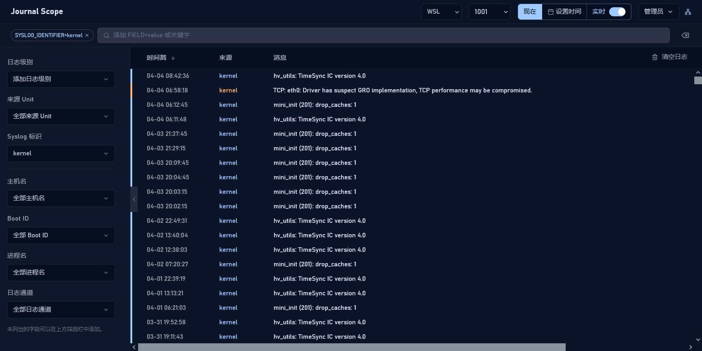
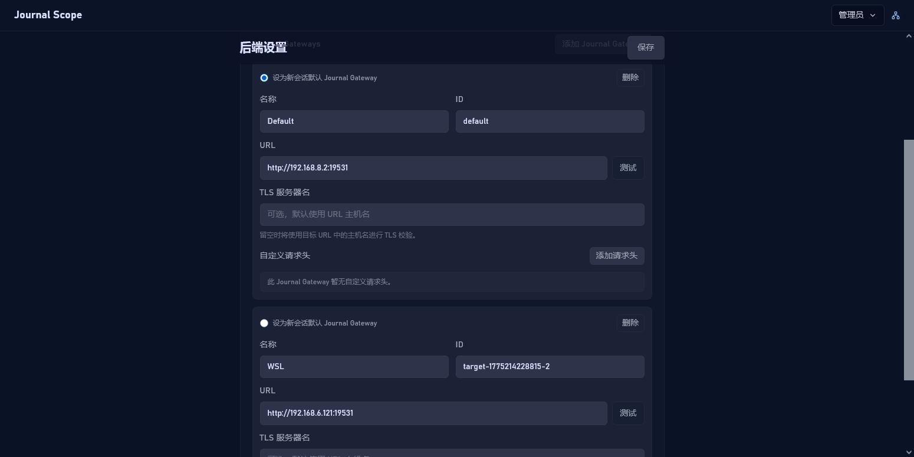
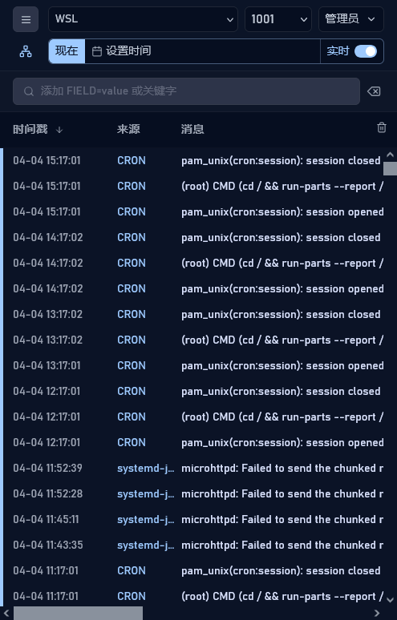

# Journal Scope

### 现代、轻量级的 systemd-journald 网页端日志查看器

[English README](../README.md)

相比于功能强大但配置复杂的重型日志观测方案，Journal Scope 提供了一个快速且易于部署的替代方案，在浏览器上展示从 `systemd-journal-gatewayd` 拉取的日志。



<details>
<summary>点击展开：更多截图（管理后台、移动端等）</summary>
<br/>





</details>

---

## 🚀 核心特性

- **实时日志流 (Live Tail)**：在浏览器实时查看日志。
- **过滤查询**：支持按服务单元 (Unit)、Syslog ID、主机名、Boot ID、传输方式和日志级别等方式过滤。
- **多 Journal Gateway 切换**：切换多个 Journal Gateway 目标。
- **PWA 与移动端支持**：响应式设计，支持 PWA，在桌面和移动端可作为应用安装。
- **低资源占用**：轻量级 Go 后端，静态资源内嵌，无需配置复杂的运行环境。

---

## 🚀 部署与设置

### 1. 准备工作：开启 Journal Gateway

Journal Scope 依赖 `systemd-journal-gatewayd` 来获取日志。

```bash
# 安装组件 (以 Debian/Ubuntu 为例)
sudo apt install systemd-journal-remote

# 启动并开启 Socket
sudo systemctl enable --now systemd-journal-gatewayd.socket
```
*注意：该服务默认在所有接口上监听 19531 端口。若需修改或限制监听 IP（例如仅限本地访问），请执行 `sudo systemctl edit systemd-journal-gatewayd.socket` 并添加以下内容：*

```ini
[Socket]
ListenStream=
ListenStream=127.0.0.1:19531
```
> [!TIP]
> 配置 mTLS 是更可靠的安全手段。然而目前 Debian 的 `systemd-journal-gatewayd` 存在导致 mTLS 无法正常工作的已知问题（见 [Debian Bug #1100729](https://bugs.debian.org/cgi-bin/bugreport.cgi?bug=1100729)）。

### 2. 运行 Journal Scope

#### 方式 A：使用 Docker
```bash
docker run --name journal-scope -d -p 3030:3030 \
  -v ./journal-scope-data:/data \
  ghcr.io/outlook84/journal-scope:latest
```

#### 方式 B：使用二进制文件
从 [Releases](https://github.com/anshi/stitch/releases) 下载对应系统的二进制文件：
```bash
# 运行
./journal-scope
```
启动后访问 Web 界面，利用 `admin` 访问码登录后，点击右上角菜单中的 **Backend** 添加 Journal Gateway 地址。

> [!IMPORTANT]
> **首次运行**：初始的 `admin` 和 `viewer` 访问码将打印在**终端输出** 或 **Docker 日志**中。
> 
> **忘记管理员访问码？**
> 1. 停止运行 Journal Scope。
> 2. 编辑 `data/config.json` 文件（默认路径）。
> 3. 将 `admin_code_hash` 的值改为 `""`（空字符串）并保存。
> 4. 重新启动程序，新的管理员访问码将再次打印在启动日志中。

---

## ⚙️ 环境变量说明

### 服务器设置
| 变量 | 说明 | 默认值 |
| :--- | :--- | :--- |
| `JOURNAL_SCOPE_LISTEN_ADDR` | 服务器监听地址 | `127.0.0.1:3030` |
| `JOURNAL_SCOPE_DATA_DIR` | 持久化数据目录 | `data` |
| `JOURNAL_SCOPE_TRUST_PROXY_HEADERS` | 信任来自反向代理的 `X-Forwarded-For` | `false` |

<details>
<summary>点击展开：更多环境变量</summary>
<br/>

### 安全与认证
| 变量 | 说明 | 默认值 |
| :--- | :--- | :--- |
| `JOURNAL_SCOPE_MASTER_SECRET` | 部署级根密钥（未设置则自动生成并持久化） | *自动生成* |
| `JOURNAL_SCOPE_BOOTSTRAP_ADMIN_CODE` | 初始管理员访问码（仅在首次启动时有效） | *自动生成* |
| `JOURNAL_SCOPE_SESSION_TTL` | 会话有效期 | `168h` |
| `JOURNAL_SCOPE_COOKIE_SECURE` | 为 Cookie 设置 `Secure` 属性（通过 HTTPS 提供服务时建议启用） | `false` |

### Journal Gateway 连接
| 变量 | 说明 |
| :--- | :--- |
| `JOURNAL_SCOPE_GATEWAY_CA_FILE` | 校验 Gateway mTLS 连接的 PEM CA 证书包 |
| `JOURNAL_SCOPE_GATEWAY_CLIENT_CERT_FILE` | 用于 Gateway mTLS 连接的 PEM 客户端证书 |
| `JOURNAL_SCOPE_GATEWAY_CLIENT_KEY_FILE` | 用于 Gateway mTLS 连接的 PEM 客户端私钥 |

</details>

---

## 📝 说明

- **日志限制**：目前最多从 Journal Gateway 拉取 10,000 条日志。
- **过滤逻辑**：
  - 不同字段 (Field) 之间是 **AND** 关系。
  - 同一字段出现多次则是 **OR** 关系。
- **关键词过滤**：关键词搜索 (Keyword) 仅针对前端已拉取的日志数据进行过滤。
  - 空格分隔的词是 **AND**：`error timeout`
  - 双引号用于短语字面量：`"connection reset"`
  - 前缀 `-` 表示排除某个词或短语：`error -timeout`、`-"retry later"`
  - 未加引号的 `FIELD=value` 会被当作字段过滤；加引号后会保留为关键词字面量：`SYSLOG_IDENTIFIER=sshd`、`"SYSLOG_IDENTIFIER=sshd"`
  - 当字段值本身包含空格时，使用 `FIELD="value with spaces"`：`MESSAGE="connection reset by peer"`

---

## 📄 许可证
本项目采用 MIT 许可证。
